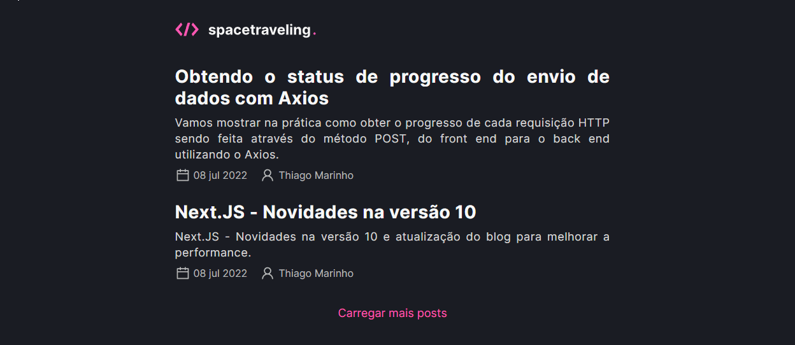
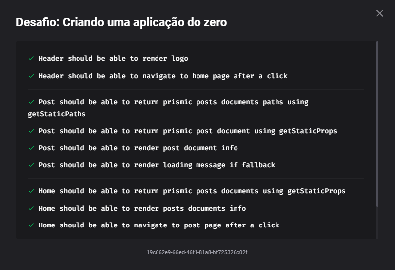

<div align="center" id="top">
  

&#xa0;

  <!-- <a href="https://criandoumprojetodozero.netlify.com">Demo</a> -->
</div>

<h1 align="center">Spacetraveling</h1>

<p align="center">
  

  

  

  <!--  -->

  <!--  -->

  <!--  -->
</p>

<!-- Status -->

<!-- <h4 align="center">
	🚧  Criando Um Projeto Do Zero 🚀 Em construção...  🚧
</h4>

<hr> -->

<p align="center">
  <a href="#dart-sobre">Sobre</a> &#xa0; | &#xa0;
  <a href="#-testes">Testes</a> &#xa0; | &#xa0;
  <a href="#rocket-tecnologias">Tecnologias</a> &#xa0; | &#xa0;
  <a href="#white_check_mark-pré-requisitos">Pré requisitos</a> &#xa0; | &#xa0;
  <a href="#checkered_flag-começando">Começando</a> &#xa0; | &#xa0;
  <a href="https://github.com/kacyos" target="_blank">Autor</a>
</p>

<br>

## :dart: Sobre

<div>
  
</div>

<h3 align="center">Desafio do curso Ignite da Rocketseat 🚀</h3>

<h3>💻 Sobre o desafio:</h3>

Essa será uma aplicação onde o seu principal objetivo é criar um blog do zero. Você vai receber uma aplicação praticamente em branco que deve consumir os dados do Prismic e ter a interface implementada conforme o layout do Figma. Você terá acesso a diversos arquivos para implementar:

- Estilizações global, comun e individuais;
- Importação de fontes Google;
- Paginação de posts;
- Cálculo de tempo estimado de leitura do post;
- Geração de páginas estáticas com os métodos `getStaticProps` e `getStaticPaths`;
- Formatação de datas com `date-fns`;
- Uso de ícones com `react-icons`;
- Requisições HTTP com `fetch`;

## 🧪 Testes:

<div>
  
</div>

## :rocket: Tecnologias

As seguintes ferramentas foram usadas na construção do projeto:

- [NextJs](https://nextjs.org/)
- [TypeScript](https://www.typescriptlang.org/)
- [SCSS](https://sass-lang.com/)
- [Prismic](https://prismic.io/)

## :white_check_mark: Pré requisitos

Antes de começar :checkered_flag:, você precisa ter o [Git](https://git-scm.com) e o [Node](https://nodejs.org/en/) instalados em sua maquina.

## :checkered_flag: Começando

```bash
# Clone este repositório
$ git clone https://github.com/kacyos/spacetraveling_posts.git

# Entre na pasta
$ cd spacetraveling_posts

# Instale as dependências
$ yarn

# Para iniciar o projeto
$ yarn dev

# Para rodar os testes
$ yarn test


# O app vai inicializar em <http://localhost:3000>
```

Feito com :heart: por <a href="https://github.com/kacyos" target="_blank">Cacio de Castro</a>

&#xa0;

<a href="#top">Voltar para o topo</a>
